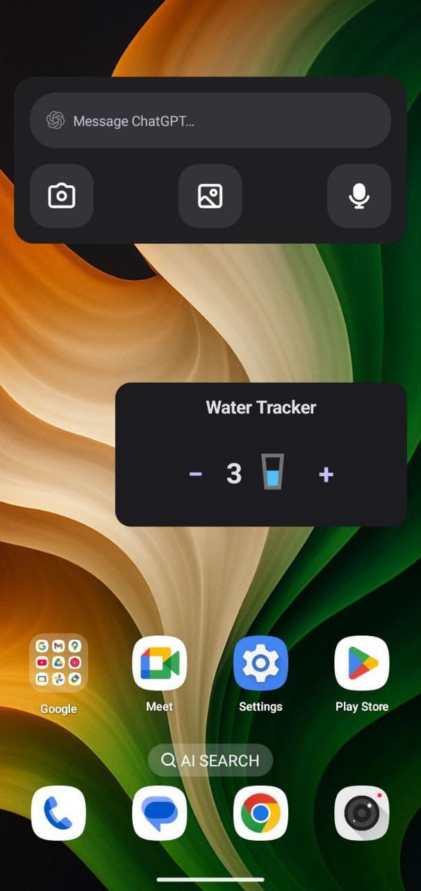

🚰 Water Tracker Widget (Android • Jetpack Glance)

A clean and modern Jetpack Glance App Widget that lets users track their daily water intake directly from the home screen.

Built fully with Jetpack Compose, Glance, Material 3, AppWidget, and DataStore Preferences for persistent widget state.

✨ Features
✅ Elegant Home Screen Widget

Minimal & modern design

Uses Material 3 Glance styling

Rounded corners & clean UI

➕➖ Quick Water Counter

Tap “+” to increase count

Tap “−” to decrease count

Count never goes below 0

💾 State Persistence

Saves counter using DataStore

Widget remembers value even after reboot

⚡ Powered by Jetpack Glance

Fast rendering

Compose-like UI for widgets

No RemoteViews headache

📦 Tech Stack
Component	Purpose

Glance AppWidget	Build widget UI using Compose-like API

Material 3 (Glance)	Styling & theming

DataStore Preferences	Persistent state storage

Vector Drawable	Water glass icon

Kotlin	Logic & architecture

1️⃣ Add dependencies

implementation("androidx.glance:glance-appwidget:1.1.1")

implementation("androidx.glance:glance-material3:1.1.1")

2️⃣ Add the receiver inside AndroidManifest.xml

<receiver
    
    android:name=".ui.theme.WaterTrackerWidgetReceiver"
    
    android:exported="false">
    
    <intent-filter>
    
        <action android:name="android.appwidget.action.APPWIDGET_UPDATE" />
        
    </intent-filter>
    
    <meta-data
    
        android:name="android.appwidget.provider"

        
        android:resource="@xml/water_tracker_widget_info" />
        
</receiver>

## 🌟 Widget Preview

Here's how the Water Tracker looks on your home screen 👇

